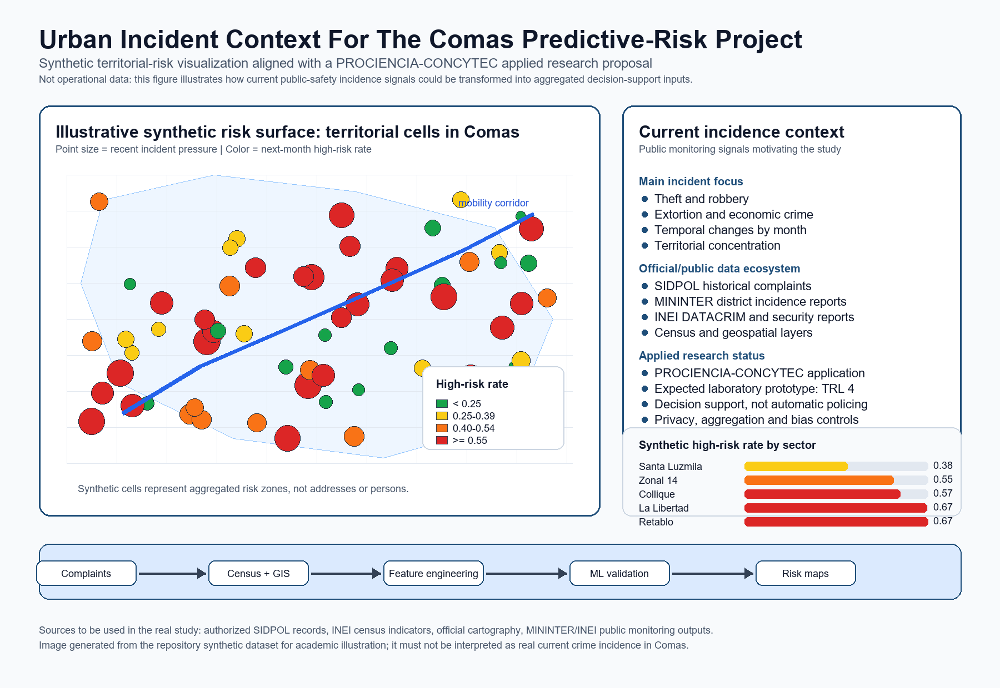

# Paradigm Justification Statement

## 1. Research Topic And Context

Urban crime risk in Lima Metropolitana is shaped by population density, land-use patterns, mobility corridors, commercial activity, socioeconomic vulnerability, and uneven public-security capacity. The district of Comas is a relevant case because it combines high urban complexity with strong pressure on preventive management.

The current research topic is the development and validation of a predictive model of urban crime risk for Comas. The proposal focuses on patrimonial and economic crime risk, using historical police complaint records, census variables, and geospatial segmentation to estimate risk levels across territorial units and time periods.

## 2. Public Incidence Context And PROCIENCIA-CONCYTEC Orientation

This work is also framed as an applied research proposal being prepared for a PROCIENCIA-CONCYTEC project application. In that sense, the repository is not only a course artifact; it is an early methodological and technical structure for a potential publicly funded research project oriented toward technological validation, reproducibility, and responsible use of urban-security data.

The figure above is a conceptual illustration of a possible future territorial risk surface. It is not an empirical output from the current district-level dataset and must not be interpreted as a validated map of Comas.

The public monitoring context includes the MININTER district-level crime incidence portal, the MININTER georeferenced crime map, INEI DATACRIM, and INEI citizen-security statistics. The repository now implements a real public-data district-month benchmark for Comas. It does not create an empirical intradistrict map because the published table contains no finer spatial units or coordinates.

The current contribution is a reproducible district-level forecasting benchmark. The intended longer-term contribution remains a responsibly validated aggregate geospatial prototype, conditional on authorized data and TRL evidence. It is designed as research decision support, not automatic policing or individual-level surveillance.

- MININTER district-level crime incidence portal: <https://observatorio.mininter.gob.pe/content/incidencia-delictiva-distrital-0>
- MININTER georeferenced crime map: <https://observatorio.mininter.gob.pe/MapaDelDelitoGeorreferenciado>
- INEI DATACRIM map panel: <https://datacrim.inei.gob.pe/panel/mapa>
- INEI citizen-security statistics: <https://m.inei.gob.pe/biblioteca-virtual/boletines/estadisticas-de-seguridad-ciudadana/1/>
- PROCIENCIA institutional portal: <https://prociencia.gob.pe/>

## 3. Preliminary Research Question

To what extent can an integrated Machine Learning and geospatial analysis model predict urban crime-risk levels in Comas, Lima Metropolitana, using historical police complaints and socioeconomic-territorial variables?

## 4. Chosen Paradigm And Justification

The most appropriate starting point is a **quantitative applied technological paradigm**. The project is not only trying to understand crime patterns descriptively; it is trying to build, test, and validate a computational artifact that can support preventive decision-making.

The quantitative component is necessary because the core evidence will come from structured records: incident counts, time periods, territorial units, census indicators, and engineered geospatial features. The applied technological component is equally important because the intended output is a TRL 4 laboratory prototype: a predictive model and an analytical workflow that can later support dashboards, risk maps, and institutional decision support.

I am not choosing a purely interpretivist paradigm as the main frame because interviews or narratives alone cannot validate the predictive performance of the proposed model. Qualitative work could later help understand institutional adoption, ethical concerns, or operational constraints, but the central research task in this phase is computational and empirical.

I am also not choosing a purely theoretical computer-science paradigm. The project is not just about inventing a new algorithm; it is about adapting and validating supervised learning methods for a concrete urban-management problem in Comas.

## 5. Implications Of The Paradigm Choice

This paradigm points toward an experimental and reproducible workflow:

- integration of historical SIDPOL-style complaint data, census indicators, and official cartography
- construction of territorial and temporal features
- supervised classification of crime-risk levels
- comparison of models such as Random Forest, Gradient Boosting, Support Vector Machines, and neural networks
- validation through metrics such as precision, recall, F1-score, AUC-ROC, and temporal holdout testing
- generation of geospatial outputs that can be interpreted as risk surfaces or risk maps

The expected contribution is both scientific and practical. Scientifically, the project can show which territorial, socioeconomic, and temporal variables are most informative for risk prediction. Practically, it can demonstrate the feasibility of moving from retrospective description toward preventive, evidence-based urban-security management.

## 6. Main Tension

The main tension is ethical and operational. Crime prediction can be useful for prevention, but it can also reinforce historical reporting bias, over-policing, or unequal surveillance if it is used without safeguards. For that reason, the model should be validated as a decision-support prototype, not as an automatic enforcement tool. Outputs must be aggregated, privacy-preserving, explainable, and accompanied by bias and responsible-use checks before any institutional adoption.
