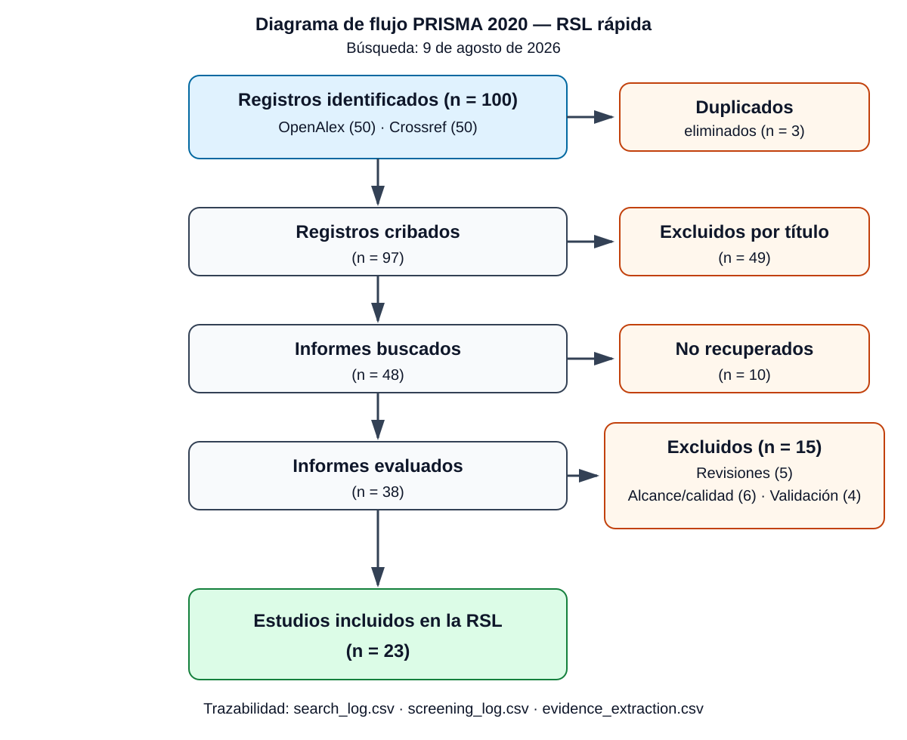

# Flujo PRISMA 2020 ejecutado

**Fecha:** 9 de agosto de 2026. **Fuentes:** OpenAlex y Crossref. **Alcance:** primeros 50 resultados por relevancia de cada fuente.

| Etapa | n |
|---|---:|
| Registros identificados: OpenAlex | 50 |
| Registros identificados: Crossref | 50 |
| **Total identificado** | **100** |
| Duplicados eliminados | 3 |
| Registros únicos cribados | 97 |
| Excluidos por título mediante regla reproducible | 49 |
| Informes buscados | 48 |
| Informes no recuperados en acceso abierto | 10 |
| Informes evaluados | 38 |
| Excluidos a texto completo | 15 |
| **Estudios empíricos incluidos** | **23** |

## Exclusiones a texto completo

| Razón principal | n |
|---|---:|
| Revisión secundaria sin nuevo estudio empírico | 5 |
| Alcance o calidad documental insuficiente | 6 |
| Validación predictiva no verificable o fuera del alcance | 4 |
| **Total** | **15** |

Comprobación: `100 − 3 = 97`; `97 − 49 = 48`; `48 − 10 = 38`; `38 − 15 = 23`.

Las decisiones están en `screening_log.csv`, los resultados originales en `search_results_2026-08-09.csv` y la regla en `run_literature_search.ps1`. Scopus, Web of Science, IEEE Xplore, ACM Digital Library y SciELO quedan como ampliación institucional pendiente; por ello, este flujo corresponde a una RSL rápida reproducible y no a exhaustividad universal.
