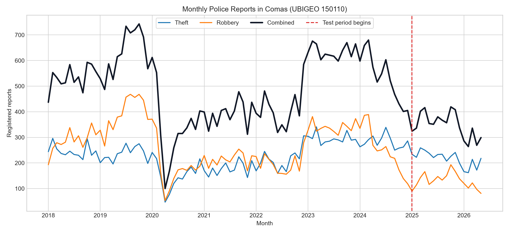
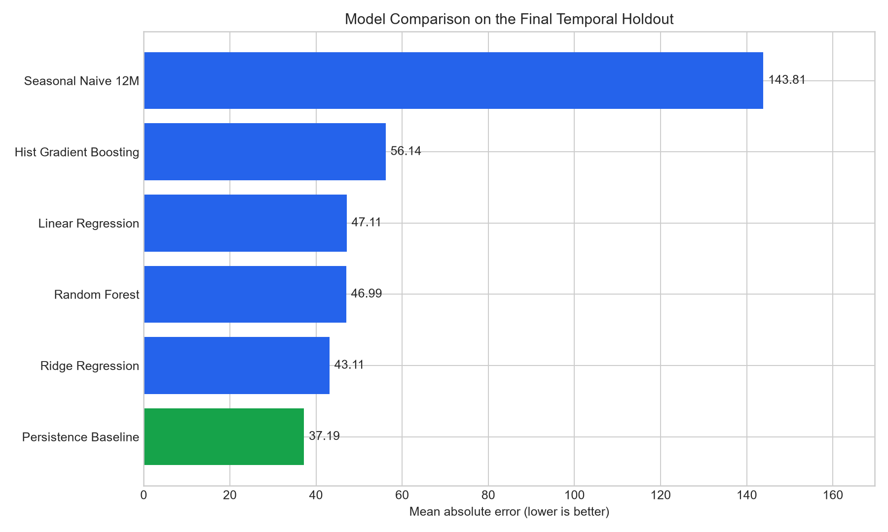
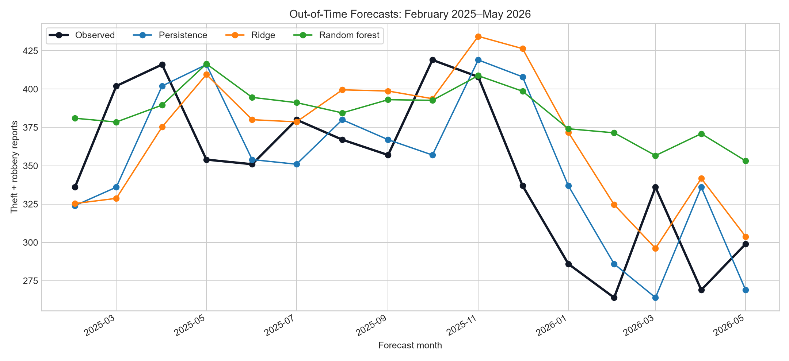

# Completed Machine-Learning Project Booklet

## Monthly Property-Crime Forecasting in Comas, Metropolitan Lima

**Researcher:** Enrique Lee Huamani Uriarte

**Data source:** Ministry of the Interior / SIDPOL

**Study period:** January 2018–May 2026
**Geographic scope:** Comas District, UBIGEO 150110

## Executive summary

This project prepared and evaluated a reproducible forecasting pipeline using official public police-report data for Comas. The study focused on theft and robbery, aggregated monthly, and predicted the next month's combined report volume. Six approaches were evaluated under a temporal holdout: two transparent baselines and four machine-learning regressors.

The persistence baseline achieved the best test performance (MAE 37.19; RMSE 44.95; R² 0.141; MAPE 11.05%). Ridge regression was the strongest trained model but did not outperform persistence. The correct conclusion is therefore that the tested machine-learning models do not yet provide sufficient incremental predictive value over the most recent observed month.

## 1. Research objective

To determine whether machine-learning models using lagged, seasonal, and trend features can improve next-month prediction of aggregated theft and robbery reports in Comas compared with simple historical baselines.

## 2. Provenance and licensing

The source is the *Police Reports Dataset, January 2018–May 2026*, published by Peru's Ministry of the Interior on the National Open Data Platform. It originates from SIDPOL and is distributed under the Open Data Commons Attribution License.

The downloaded table is aggregated and contains: year, month, department, province, district, UBIGEO, crime category, and count. No personal information is used.

## 3. Scope and descriptive results

- National source rows: preserved in the official CSV.
- Comas source rows across all categories: 698.
- Monthly periods for Comas: 101.
- All-category reports in Comas: 144,736.
- Theft reports: 22,934.
- Robbery reports: 24,620.
- Property-crime outcome total: 47,554.
- Average theft-plus-robbery reports per month: 470.83.

Violence against women and family members, extortion, fraud, kidnapping, and the ambiguous “Other” group were not combined with the property-crime outcome.

## 4. Data preparation

The workflow filters Comas through UBIGEO `150110`, pivots theft and robbery into separate monthly columns, and creates a complete monthly index. The response variable is shifted one month forward so that each row uses information available by month *t* to predict reports in month *t + 1*.

## 5. Feature engineering

The final feature set contains:

- current theft, robbery, and combined property-crime reports;
- one-, two-, three-, six-, and twelve-month lags;
- three- and six-month rolling means using past values only;
- recent change between one- and three-month lags;
- linear time index;
- sine and cosine encoding of month-of-year seasonality.

All rolling features are shifted before calculation to avoid future-information leakage.

## 6. Validation design

Observations before January 2025 form the training set. Months from January 2025 onward form the test feature period, predicting February 2025 through May 2026. The temporal order is never shuffled. Random forest was repeated with seeds 13, 21, 42, 87, and 100; deterministic models remain identical across seeds.

## 7. Models

1. Persistence: next month equals the current month.
2. Seasonal naive: next month equals the value from 12 months earlier.
3. Linear regression with standardized features.
4. Ridge regression with standardized features and L2 regularization.
5. Random forest regression.
6. Histogram gradient-boosting regression.

## 8. Results

| Rank | Model | MAE | RMSE | R² | MAPE |
|---:|---|---:|---:|---:|---:|
| 1 | Persistence baseline | **37.19** | **44.95** | **0.141** | **11.05%** |
| 2 | Ridge regression | 43.11 | 50.71 | -0.093 | 13.04% |
| 3 | Random forest | 46.99 | 56.70 | -0.368 | 15.00% |
| 4 | Linear regression | 47.11 | 54.85 | -0.279 | 14.38% |
| 5 | Histogram gradient boosting | 56.14 | 68.57 | -0.999 | 17.88% |
| 6 | Seasonal naive | 143.81 | 167.14 | -10.878 | 41.14% |

Negative R² values indicate that those models performed worse than predicting the test-set mean. The seasonal baseline failed because the series underwent substantial level changes, particularly around and after the pandemic period.

## 9. Interpretation

Recent report volume is more useful than the tested nonlinear models for this district-level monthly series. With only 101 periods and a structural disruption around 2020, flexible models can overfit historical patterns that do not persist into 2025–2026.

This finding supports a cautious operational recommendation: retain persistence as the benchmark and do not claim that machine learning currently improves forecasting. Future gains require additional predictors with known availability before the forecast date, longer post-disruption history, or finer authorized spatial units.

## 10. Limitations

- Police reports reflect events, reporting, and recording practices.
- The public dataset provides district-level aggregates, not intradistrict coordinates.
- The time series is small for high-capacity machine learning.
- COVID-19 and subsequent administrative or behavioral changes create temporal drift.
- Population exposure and socioeconomic predictors were not available in the same monthly official table.
- The analysis forecasts reports and does not identify causes or intervention effects.

## 11. Reproducibility

Run `py -3 src/run_experiments.py` from `05_pipeline`. The command recreates the experiment table, model comparison, real-data summary, and test-period forecasts. Source code, frozen official data, parameters, seeds, and outputs are versioned together.

## 12. Final conclusion

The completed real-data experiment demonstrates a valid machine-learning workflow but does not support deployment of a complex model. The simple persistence baseline remains the strongest tested approach. This transparent negative result is scientifically useful because it prevents overclaiming and establishes a defensible benchmark for future work with richer authorized data.

---

## 13. End-to-end analytical process

The following sequence was actually executed; it is not a proposed future workflow.

```text
Official MININTER/SIDPOL CSV
          │
          ▼
Filter UBIGEO 150110 (Comas)
          │
          ▼
Select theft and robbery records
          │
          ▼
Pivot to one row per calendar month
          │
          ▼
Create lags, rolling means, trend, and seasonality
          │
          ▼
Define next-month report count as target
          │
          ▼
Temporal split: historical training → final holdout
          │
          ▼
Fit 4 ML models + evaluate 2 baselines
          │
          ▼
Save forecasts, metrics, tests, and provenance
```

## 14. Raw-data structure and filtering evidence

The official file contains the following columns:

| Source field | Meaning | Example used |
|---|---|---|
| `ANIO` | Calendar year | 2018 |
| `MES` | Calendar month | 1 |
| `DPTO_HECHO_NEW` | Department | LIMA METROPOLITANA |
| `PROV_HECHO` | Province | LIMA |
| `DIST_HECHO` | District | COMAS |
| `UBIGEO_HECHO` | Six-digit geographic code | 150110 |
| `P_MODALIDADES` | Published crime category | Hurto |
| `cantidad` | Number of reports | 244 |

Example source records:

| Year | Month | Department | Province | District | UBIGEO | Category | Count |
|---:|---:|---|---|---|---|---|---:|
| 2018 | 1 | LIMA METROPOLITANA | LIMA | COMAS | 150110 | Hurto | 244 |
| 2018 | 1 | LIMA METROPOLITANA | LIMA | COMAS | 150110 | Robo | 193 |
| 2018 | 2 | LIMA METROPOLITANA | LIMA | COMAS | 150110 | Hurto | 296 |
| 2018 | 2 | LIMA METROPOLITANA | LIMA | COMAS | 150110 | Robo | 257 |

The executable filtering code is:

```python
raw = pd.read_csv(path, dtype={"UBIGEO_HECHO": str})
raw["UBIGEO_HECHO"] = raw["UBIGEO_HECHO"].str.zfill(6)
selected = raw[
    (raw["UBIGEO_HECHO"] == "150110")
    & raw["P_MODALIDADES"].isin({"Hurto": "theft", "Robo": "robbery"})
].copy()
```

This uses the geographic identifier, not a text-only district match, and therefore avoids accidentally selecting Comas Province in Junín.

## 15. Exploratory time-series analysis



The black series is the combined outcome. The red dashed line marks the start of the test feature period. The history shows a major level disruption around the COVID-19 period and lower values toward 2026. This temporal drift explains why the 12-month seasonal baseline performs poorly and why random splitting would be misleading.

## 16. Monthly aggregation code

The source rows were transformed into a complete monthly table:

```python
selected["date"] = pd.to_datetime(
    dict(year=selected["ANIO"], month=selected["MES"], day=1)
)
monthly = selected.pivot_table(
    index="date",
    columns="P_MODALIDADES",
    values="cantidad",
    aggfunc="sum",
    fill_value=0,
)
complete_index = pd.date_range(monthly.index.min(), monthly.index.max(), freq="MS")
monthly = monthly.reindex(complete_index, fill_value=0)
monthly["property_crime_reports"] = (
    monthly["theft_reports"] + monthly["robbery_reports"]
)
```

The resulting analytical series has 101 consecutive monthly periods and no duplicated month key.

## 17. Feature-engineering implementation

For month *t*, the model uses only information available by the end of that month:

```python
for lag in (1, 2, 3, 6, 12):
    df[f"lag_{lag}"] = df["property_crime_reports"].shift(lag)

df["rolling_mean_3"] = (
    df["property_crime_reports"].shift(1).rolling(3).mean()
)
df["rolling_mean_6"] = (
    df["property_crime_reports"].shift(1).rolling(6).mean()
)
df["recent_trend"] = df["lag_1"] - df["lag_3"]
df["target_next_month"] = df["property_crime_reports"].shift(-1)
```

Shifting before rolling calculation is essential: without it, a feature could contain the same-month value in an unintended way. The outcome is shifted backward one row so each observation predicts month *t + 1*.

## 18. Training and test samples

After lag construction and removal of incomplete edge rows:

| Partition | Rule | Rows | Purpose |
|---|---|---:|---|
| Training | Feature month before 2025-01 | 72 | Fit parameters and trees |
| Test | Feature month from 2025-01 onward | 16 | Forecast 2025-02 through 2026-05 |

The implementation is:

```python
train = frame[frame["date"] < pd.Timestamp("2025-01-01")]
test = frame[frame["date"] >= pd.Timestamp("2025-01-01")]

X_train = train[feature_names]
y_train = train["target_next_month"]
X_test = test[feature_names]
y_test = test["target_next_month"]

model.fit(X_train, y_train)
prediction = model.predict(X_test)
```

No future test observation is used for fitting, standardization, or hyperparameter learning.

## 19. Model specifications

| Model | Main configuration | Rationale |
|---|---|---|
| Persistence | Current month as next-month prediction | Strong transparent baseline for persistent counts |
| Seasonal naive | Twelve-month lag | Tests annual recurrence |
| Linear regression | Standardized predictors | Interpretable linear benchmark |
| Ridge regression | Standardization; alpha = 10 | Controls instability among correlated lag features |
| Random forest | 500 trees; leaf size 3; 80% feature sampling | Captures nonlinearities and interactions |
| Histogram gradient boosting | 250 iterations; learning rate 0.05; 15 leaves | Regularized nonlinear boosting |

The random forest was trained using five seeds. Every model was evaluated on exactly the same months.

## 20. Metric definitions

For observed values \(y_i\), forecasts \(\hat{y}_i\), and \(n\) test months:

- **MAE:** mean absolute difference, in police-report counts.
- **RMSE:** square root of mean squared error; penalizes large errors.
- **R²:** improvement relative to predicting the test mean; negative values indicate worse performance than that comparator.
- **MAPE:** mean absolute percentage error; communicates proportional error.

Model selection prioritizes MAE because its unit is directly interpretable as the typical absolute error in monthly reports.

## 21. Visual model comparison



The green bar identifies the best approach. Every trained machine-learning model has a larger MAE than persistence. Model complexity did not yield incremental test value.

## 22. Out-of-time predictions



The figure compares observed values with persistence, ridge regression, and random forest. Random forest remains excessively high during the early-2026 decline, illustrating its difficulty adapting to the changed level.

The complete test evidence is:

| Forecast month | Observed | Persistence | Ridge | Random forest |
|---|---:|---:|---:|---:|
| 2025-02 | 336 | 324 | 325.36 | 380.97 |
| 2025-03 | 402 | 336 | 328.73 | 378.52 |
| 2025-04 | 416 | 402 | 375.30 | 389.54 |
| 2025-05 | 354 | 416 | 409.52 | 416.45 |
| 2025-06 | 351 | 354 | 380.04 | 394.58 |
| 2025-07 | 380 | 351 | 378.61 | 391.16 |
| 2025-08 | 367 | 380 | 399.51 | 384.47 |
| 2025-09 | 357 | 367 | 398.73 | 393.08 |
| 2025-10 | 419 | 357 | 393.73 | 392.66 |
| 2025-11 | 408 | 419 | 434.39 | 408.76 |
| 2025-12 | 337 | 408 | 426.38 | 398.61 |
| 2026-01 | 286 | 337 | 371.86 | 374.12 |
| 2026-02 | 264 | 286 | 324.67 | 371.47 |
| 2026-03 | 336 | 264 | 296.12 | 356.64 |
| 2026-04 | 269 | 336 | 341.76 | 370.92 |
| 2026-05 | 299 | 269 | 303.84 | 353.19 |

## 23. Reproducibility evidence

The official data artifact is identified by:

```text
File: sidpol_police_reports_2018_2026.csv
Size: 26,896,357 bytes
SHA-256: CDC6D3D32A37A00FF7F2F1D15D65512FEC3A36A0291BB67FEDE482CA1FFB22BC
```

Execute the complete workflow with:

```powershell
cd 05_pipeline
py -3 src/run_experiments.py
py -3 src/make_figures.py
py -3 -m unittest discover -s ..\tests -p "test_*.py"
```

The automated tests verify the 101-month scope, the total of 47,554 property-crime reports, unique ordered months, and complete model features and target.

## 24. Where every piece of evidence is stored

| Evidence | File |
|---|---|
| Official source data | `data/sidpol_police_reports_2018_2026.csv` |
| Source URL, license, hash | `docs/source_manifest.csv` |
| Field definitions | `docs/data_dictionary.csv` |
| Data processing and training | `src/train.py` |
| Repeated experiments | `src/run_experiments.py` |
| Figure generation | `src/make_figures.py` |
| All seed-level metrics | `docs/experiment_results.csv` |
| Mean model comparison | `docs/model_comparison.csv` |
| Month-level predictions | `docs/test_period_forecasts.csv` |
| Executable walkthrough | `notebook.ipynb` |
| Automated verification | `tests/test_real_sidpol_pipeline.py` |

This separation allows an evaluator to move from narrative claims to raw evidence, executable code, and saved outputs.
